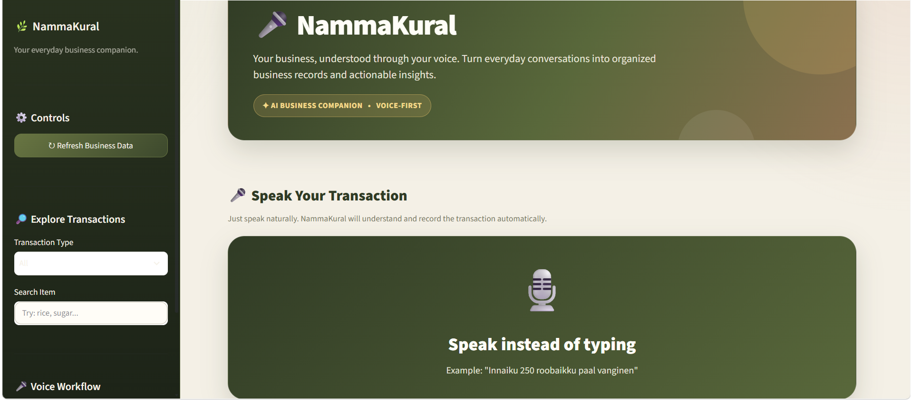
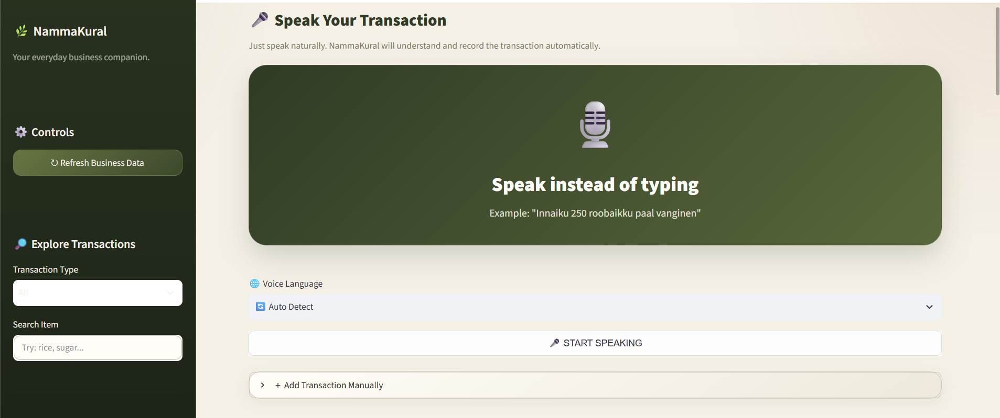
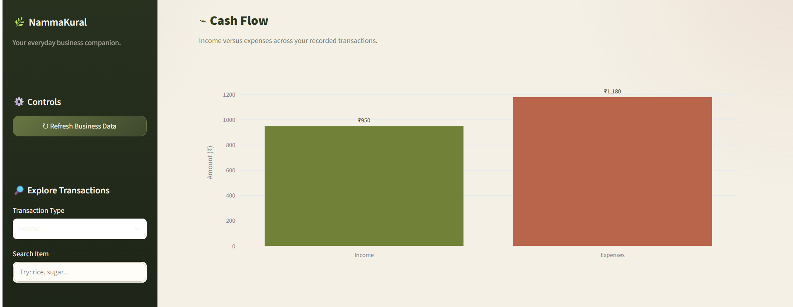
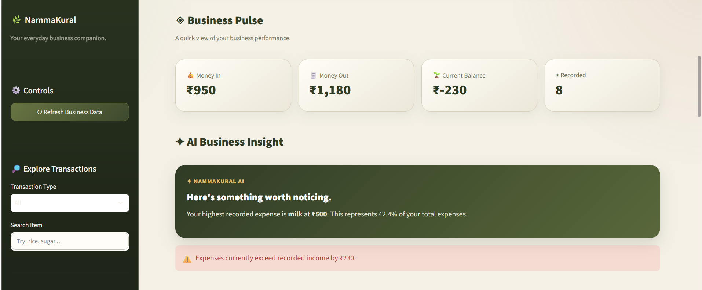
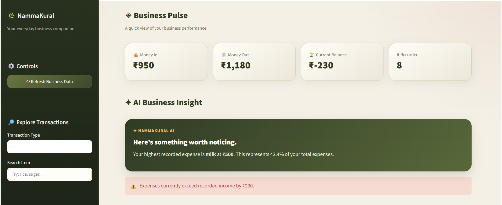
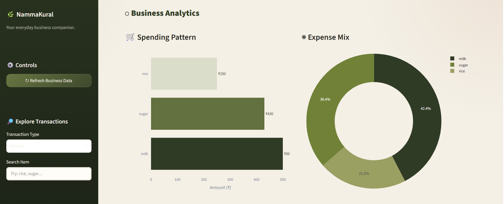
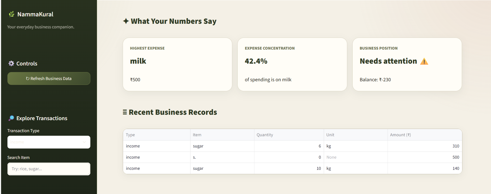

# 🎤 NammaKural

<div align="center">

### 🗣️ Speak your transaction. Let AI handle the bookkeeping.

**An AI-powered, voice-first bookkeeping assistant for small businesses.**

**Voice → AI → Transaction → Database → Insights**

</div>

---

## 🌱 Why NammaKural?

For many small business owners, bookkeeping still means notebooks, memory, calculators, or manually updating spreadsheets.

That creates a simple but important problem:

> **Recording a ₹250 transaction shouldn't require opening a complicated accounting system.**

NammaKural takes a different approach.

Instead of typing:

`Expense → Rice → ₹250`

the user can simply say:

> 🎤 **"I bought rice for 250 rupees."**

NammaKural transforms that natural voice input into structured business data.

---

## 🚀 What NammaKural Does

| 🎤 Voice | 🧠 AI | 🗄️ Store | 📊 Understand |
| --- | --- | --- | --- |
| Speak naturally | Convert & parse | Save transactions | Analyze business data |

### The result?

**Less typing. Less friction. Better visibility into daily business finances.**

---

## 🏗️ How It Works

NammaKural follows a voice-to-insight pipeline that transforms natural speech into structured business information.

```text
             🎤 BUSINESS OWNER
                    |
                    | Natural Voice
                    v
          +-----------------------+
          | 🗣️ SPEECH-TO-TEXT    |
          |       Whisper         |
          +-----------+-----------+
                      |
                      | Transcribed Text
                      v
          +-----------------------+
          | 🧠 TRANSACTION        |
          |       PARSER          |
          |     Python / NLP      |
          +-----------+-----------+
                      |
                      | Structured Data
                      v
          +-----------------------+
          | 💰 TRANSACTION        |
          |       OBJECT          |
          +-----------+-----------+
                      |
                      v
          +-----------------------+
          | 🗄️ MYSQL DATABASE     |
          +-----------+-----------+
                      |
                      | Stored Data
                      v
          +-----------------------+
          | 📊 STREAMLIT          |
          |       DASHBOARD       |
          +-----------+-----------+
                      |
                      v
          +-----------------------+
          | 💡 BUSINESS           |
          |       INSIGHTS        |
          +-----------------------+
🔄 Core Pipeline

Voice → Speech-to-Text → Transaction Parsing → MySQL → Analytics → Insights

✨ Current Features
🎤 Voice-First Input

Record a natural business transaction instead of manually filling multiple fields.

🗣️ Speech-to-Text

Uses Whisper to convert spoken transactions into text.

🧠 Transaction Parsing

Extracts useful information from natural language such as:

Transaction type
Item
Quantity
Unit
Amount
🗄️ MySQL Storage

Structured transactions are stored in a MySQL database for persistent access.

📊 Business Dashboard

The Streamlit dashboard provides:

💰 Income
💸 Expenses
💵 Balance
🔢 Transaction count
📈 Cash-flow overview
🛒 Expense by item
📊 Expense distribution
💡 Smart Insights

The dashboard highlights useful business information such as:

Highest expense
Expense concentration
Overall business health
🧪 Real-World Example
🎤 User says

"I bought 5 kg rice for 250 rupees."

🗣️ Speech-to-Text

Whisper converts the spoken transaction into text.

I bought 5 kg rice for 250 rupees.

🧠 Transaction Parser

NammaKural extracts the important information:

Field	Value
Transaction Type	Expense
Item	Rice
Quantity	5
Unit	kg
Amount	₹250
🗄️ Database

The structured transaction is stored in MySQL.

📊 Dashboard

The transaction becomes part of the business analytics and insights.

🛠️ Technology Stack
Layer	Technology
Programming Language	Python
Speech Recognition	OpenAI Whisper
NLP / Parsing	Python + Rule-Based Parsing
Database	MySQL
Data Processing	Pandas
Visualization	Plotly
Dashboard	Streamlit
Version Control	Git + GitHub
📁 Project Structure
NammaKural/
|
├── dashboard.py
├── speech_to_text.py
├── transaction_parser.py
├── save_transaction.py
|
├── test_mysql.py
├── voice_test.py
├── voice_to_text_test.py
├── voice_transaction.py
|
├── database_schema.sql
├── requirements.txt
├── README.md
└── .gitignore
⚙️ Getting Started
1. Clone the Repository
git clone https://github.com/DharshanaSenthilkumar/NammaKural.git
cd NammaKural
2. Install Dependencies
py -m pip install -r requirements.txt
3. Configure MySQL

Create a .env file in the project directory.

MYSQL_HOST=127.0.0.1
MYSQL_PORT=3306
MYSQL_USER=root
MYSQL_PASSWORD=YOUR_PASSWORD
MYSQL_DATABASE=nammakkural

⚠️ Never commit your .env file. It is already excluded using .gitignore.

4. Create the Database

Run the SQL commands inside:

database_schema.sql

5. Start the Dashboard
streamlit run dashboard.py
## 🎬 Demo

### 🎤 Voice → Transaction

A user speaks a transaction naturally:

> **"I bought rice for 250 rupees."**

NammaKural converts the voice input into structured transaction data.

| Field | Result |
| --- | --- |
| Type | Expense |
| Item | Rice |
| Amount | ₹250 |

The transaction is then stored in MySQL and reflected in the Streamlit dashboard.

---

## 📸 Product Showcase

### 📊 Dashboard Overview



---

### 🎤 Voice Input



---

### 💰 Cash Flow



---

### 📈 Business Analytics



---

### 💡 AI Insights



---

### 🧠 Detailed Analytics



---

### ⚙️ Business Records




🔐 Security

NammaKural keeps sensitive information outside the public repository.

The following files are excluded using .gitignore:

.env
transactions.csv
*.ogg
*.wav
*.mp3
*.m4a
__pycache__/

This helps prevent database credentials, local transaction records, and test audio files from being uploaded to GitHub.

🔮 Future Roadmap

NammaKural is currently a working prototype.

Planned improvements include:

 🇮🇳 Tamil voice support
 💬 Tamil + Tanglish support
 📱 Flutter mobile application
 🌐 Flask / FastAPI backend
 🧠 Advanced AI business insights
 📈 Predictive cash-flow analysis
 🔮 Business forecasting
 👥 Multi-user support
 ☁️ Cloud deployment
 📡 Offline voice processing
🎯 Vision

Make bookkeeping as simple as having a conversation.

NammaKural aims to make digital financial management more accessible to small businesses by replacing complicated manual data entry with natural voice interaction.

👩‍💻 Project
🎤 NammaKural

AI-powered voice-first bookkeeping assistant for small businesses.

Built with:

Python • Whisper • NLP • MySQL • Streamlit • Pandas • Plotly

🚀 Voice → Data → Decisions